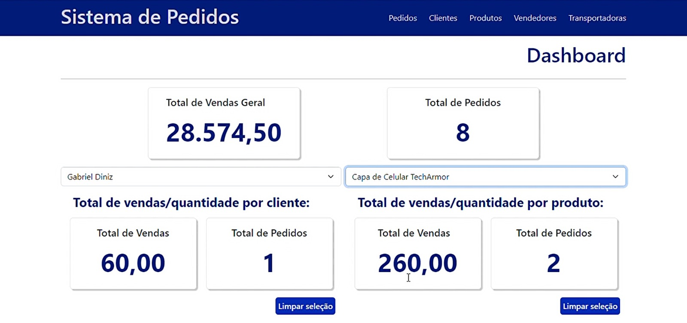
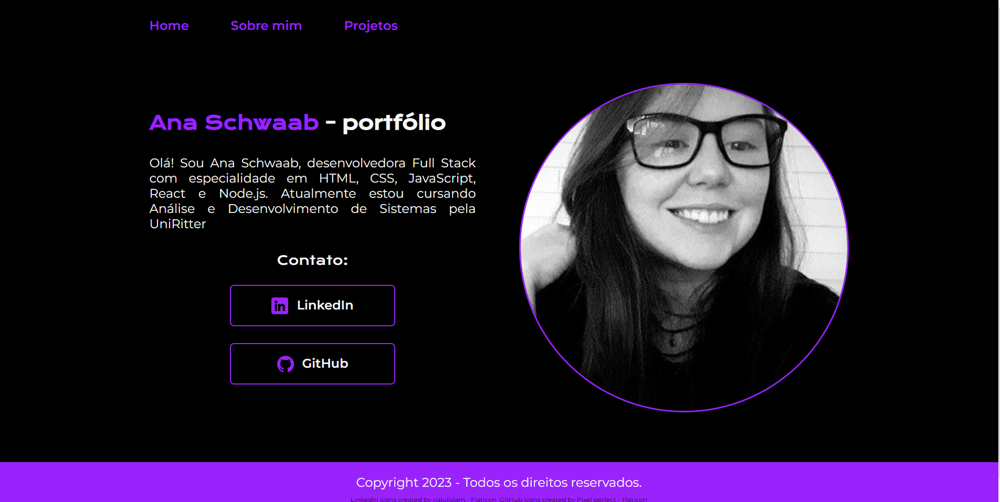

# Olá, me chamo Ana Schwaab 👋

Neste espaço compartilho alguns projetos e meu aprendizado na área de desenvolvimento web.

##  Principais tecnologias e ferramentas

  
  
  
  
  
  
  <a href="https://firebase.google.com/"> </a>
  
  
  
  
  

 

  
  
  

## Projetos

<!-- 

  

  ### Sistema de Pedidos

  
  
  - [Backend - Node.js](https://github.com/anaschwaab/desafio-back) 
  - [Frontend - React](https://github.com/anaschwaab/desafio-back)
  

  

  ### Portfólio

  
  
  - [Frontend - JavaScript Vanilla](https://github.com/anaschwaab/portfolio)
  

 -->

## 📫 Contato

- LinkedIn: [Ana Schwaab](https://www.linkedin.com/in/ana-schwaab/)
- Email: schwaabana@gmail.com

